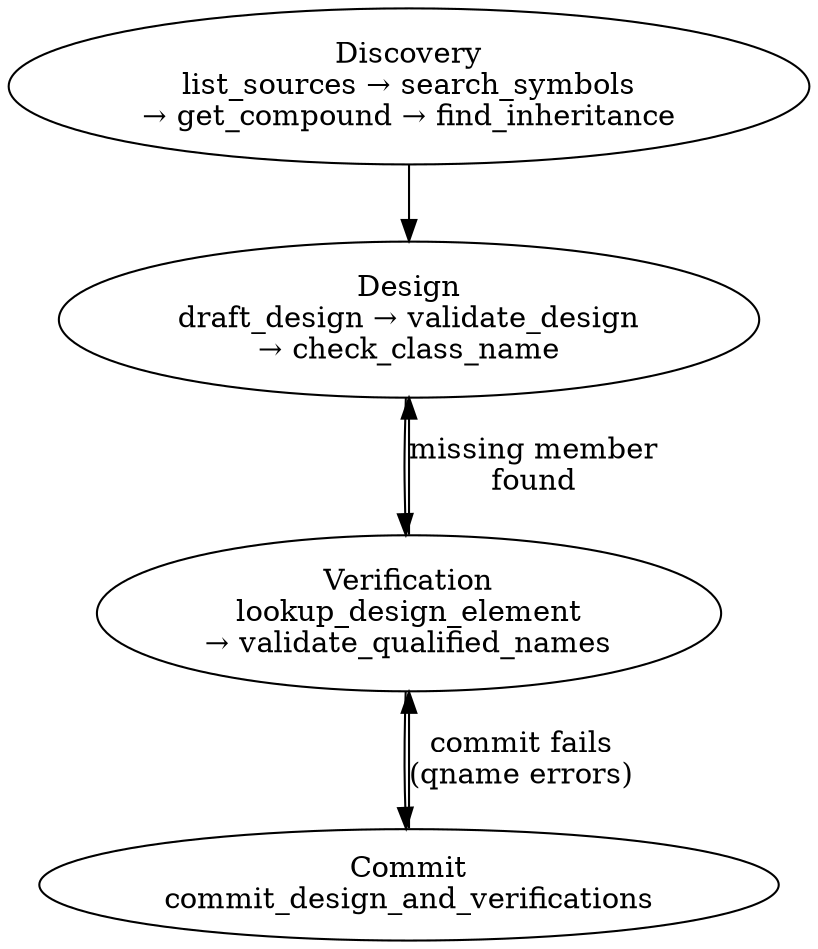

# Design: Tighten design_verify Agent Definition

## Context

The `design_verify` combined prompt (`backend/ticketing_agent/design_verify/combined_prompt.py`) has accumulated redundancy and format inconsistencies with the recently-restructured `assign_components` and `decompose_hlr` agents. The tool descriptions in the prompt text duplicate the tool schemas already passed to the LLM, seeded cppreference container types are excessive in the prompt context, the recommended workflow is a flat numbered list that doesn't convey iteration, and the FORMAT-CONTRACT uses a different example style (✓/✗) than the other agents ([Good]/[Bad] + table).

Additionally, the `format_hlrs_for_prompt` function only passes one-line LLR summaries to the design_verify agent, losing the rich verification stubs from the decompose stage. The agent needs to see the full behavioral expectations to design aligned class interfaces.

## Changes

### 1. Remove tool descriptions + section headers from SYSTEM_PROMPT; embed full LLR definitions

**Part A — Remove tool descriptions:**

Remove the entire block from the SYSTEM_PROMPT starting with "You have twelve tools available:" through the end of the `commit_design_and_verifications` description. This includes:

- The "You have twelve tools available:" header
- The "### Discovery tools" section header
- All five discovery tool descriptions (list_sources, search_symbols, get_compound, browse_namespace, find_inheritance)
- The "### Design & verification tools" section header
- All six design/verification tool descriptions (draft_design, validate_design, check_class_name, validate_qualified_names, lookup_design_element, commit_design_and_verifications)

These are redundant with the `description` fields already present in the `ALL_TOOLS` schemas passed to `call_tool_loop`. No changes to `combined_tools.py` — the tool definitions remain as-is.

**Part B — Embed full LLR definitions in the prompt:**

Currently, `format_hlrs_for_prompt` produces flat one-liners:
```
HLR 1 [Component: Calculation Engine]: The calculator...
  LLR 1: The Calculation Engine exposes a compute operation...
```

This loses the rich decompose output: verification methods, test names, preconditions, actions, postconditions, and qualified-name references.

Replace this with a new formatter `format_llrs_with_verifications_for_prompt` (in `backend/requirements/formatting.py`) that renders each LLR with its full verification stubs:

```
LLR 1: The Calculation Engine exposes a compute operation that accepts
two numeric operands and an operator string, returns the calculated
numeric result for valid inputs, and signals an error for invalid inputs.

  Verifications:
    [automated] test_compute_returns_sum_for_addition
      Invoke compute(5, 3, '+'), verify result is 8.
      Pre-conditions: (none)
      Actions: TestSuite → CalculationEngine.compute
      Post-conditions: return_value == 8

    [automated] test_compute_signals_error_on_non_numeric_operand
      Invoke compute('abc', 5, '+'), verify error signal.
      Pre-conditions: (none)
      Actions: TestSuite → CalculationEngine.compute
      Post-conditions: exception_type == "ValueError or TypeError"
```

The formatted output includes:
- LLR ID and full description
- Each verification: method, test_name, description
- Preconditions: subject, operator, expected_value (and object if present)
- Actions: caller → callee with descriptions
- Postconditions: same format as preconditions

In `combined_loop.py`, the `design_and_verify` function will receive the full decompose output (or reconstructed `DecomposedRequirementSchema` / `LowLevelRequirementSchema` data) and format it with the new formatter instead of `format_hlrs_for_prompt`.

**Files changed:**
- `backend/ticketing_agent/design_verify/combined_prompt.py` — remove tool descriptions from SYSTEM_PROMPT
- `backend/requirements/formatting.py` — add `format_llrs_with_verifications_for_prompt`
- `backend/ticketing_agent/design_verify/combined_loop.py` — use the new formatter, pass full LLR data

### 2. Remove container seeding from the prompt (keep in dep_lookup)

The `combined_loop.py` currently calls `get_container_class_info()` to fetch curated container class info and adds it to `all_dep_classes` for inclusion in the prompt's dependency API section. This is excessive — the agent rarely needs to see `std::vector`, `std::map` etc. listed upfront and can discover them via `find_mechanism`.

**What stays:** `seed_container_lookup()` continues to populate `dep_lookup` with bare→qualified name mappings. This ensures `validate_qualified_names` and `find_mechanism` can resolve container names at runtime.

**What removes from `combined_loop.py`:**
- The import of `get_container_class_info`
- The `container_classes` variable and `get_container_class_info()` call
- The code block that extends `all_dep_classes` with container classes
- The conditional that builds `dep_api_section` from `container_classes`

**Files changed:**
- `backend/ticketing_agent/design_verify/combined_loop.py` — remove `get_container_class_info` import and usage

### 3. Replace "Recommended workflow" with a dot diagram

Replace the flat numbered "Recommended workflow" section in the SYSTEM_PROMPT with a Graphviz dot diagram that makes the iterative nature explicit:



This replaces the four-step numbered list and shows both the forward flow and the two loop-back paths explicitly.

**Files changed:**
- `backend/ticketing_agent/design_verify/combined_prompt.py` — replace recommended workflow text with dot diagram

### 4. Convert FORMAT-CONTRACT qualified-names to [Good]/[Bad] + anti-patterns table

Convert the existing ✓/✗ example format to match the `assign_components` and `decompose_hlr` agent style:

- Inline examples use `[Good]` and `[Bad]` tags with `→` explanations
- A summary anti-patterns table at the bottom with columns: Anti-pattern | What goes wrong | Instead

The seven anti-patterns covered:

| Anti-pattern | What goes wrong | Instead |
|---|---|---|
| Dot separator in qname (Window.button) | Parser cannot split on :: — reference undefined | Use :: everywhere: Namespace::Class::member |
| Nested attribute path (Engine::result.is_success) | Cannot reference nested members through a single qname | Reference outer attribute and inner member separately |
| Test variable as qname (result_of_first_call) | Not a design element — lookup fails | Use design element qnames or expected_value for values |
| Test function as qname (test_validate_input) | Not a design element — lookup fails | Reference the method being tested: Namespace::Class::method |
| Label as object_qualified_name ("×") | Not a qname — expects design element reference | Use expected_value for literal values and constants |
| Description as object_qualified_name ("division operator button") | Not a qname — descriptions don't resolve | Use expected_value for descriptive text, qname for design references |
| Constructor reference (ClassName::ClassName) | No such method unless explicitly designed | Only reference constructors if they appear in the design |

**Files changed:**
- `backend/ticketing_agent/design_verify/combined_prompt.py` — reformat FORMAT-CONTRACT

## Files touched

| File | Change |
|---|---|
| `backend/ticketing_agent/design_verify/combined_prompt.py` | Remove tool descriptions, add dot diagram, reformat FORMAT-CONTRACT |
| `backend/ticketing_agent/design_verify/combined_loop.py` | Remove `get_container_class_info`, use new LLR formatter |
| `backend/requirements/formatting.py` | Add `format_llrs_with_verifications_for_prompt` |

## No changes to

- `backend/ticketing_agent/design_verify/combined_tools.py` — tool definitions remain as-is
- `backend/ticketing_agent/design/container_lookup.py` — `seed_container_lookup` and `get_container_class_info` both remain (other agents may still use `get_container_class_info`)